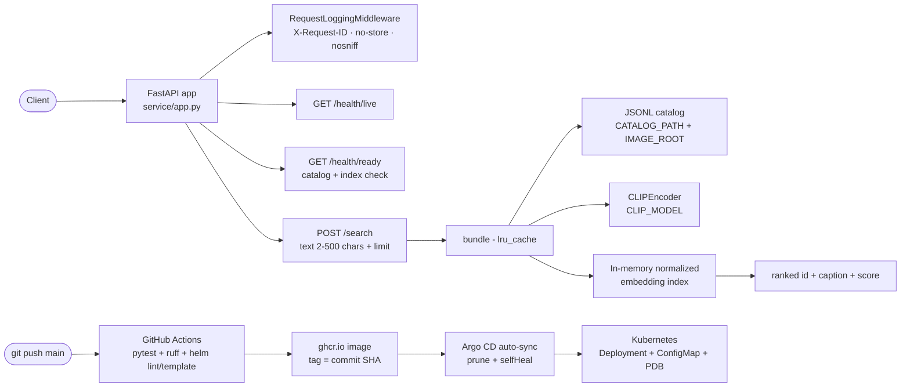

# Multimodal search

[Architecture](docs/architecture.md) · [Operations runbook](docs/operations.md) · [Helm chart](k8s/helm/multimodal-search-service/) · [Argo CD application](k8s/argocd/application.yaml)

## Overview

Text-to-image retrieval over a local image catalog using CLIP. A JSONL catalog of unique image IDs, paths, and captions is validated (paths confined to `IMAGE_ROOT`), embedded with CLIP image and caption encoders, and ranked by normalized cosine similarity against the query embedding. The index is rebuilt in memory per process — a transparent, dependency-light retrieval path with no external vector database.

This is a **reference implementation**: it has not been deployed to a production cluster and makes no claims about proprietary images or retrieval quality.

## Architecture



See [docs/architecture.md](docs/architecture.md) for request/model boundaries and [docs/operations.md](docs/operations.md) for the operator runbook.

## Measured results

Engineering measurements taken 2026-09-23 on this machine (local Linux, CPU). No business or quality metrics are claimed.

- **Tests:** 4 passed, 0 failed — `python -m pytest -q`.
- **Lint:** `ruff check .` — 0 findings (ruff 0.16.7).
- **API latency** (local uvicorn, randomly-initialized tiny CLIP model + 6-image catalog — latency only, not a quality claim): `POST /search` — p50 4.1ms, p95 25.4ms (n=150, 10 warmup requests, local uvicorn).
- **Helm:** `helm lint --strict` passed; `helm template` rendered in default and `--set autoscaling.enabled=true --set networkPolicy.enabled=true` modes; rendered manifests passed kubeconform strict schema validation (Kubernetes 1.30 schemas). Not applied to a live cluster.

## Setup

```sh
python -m venv .venv && source .venv/bin/activate
python -m pip install -e '.[test]'
python -m pytest -q
ruff check .
```

## Usage

Build a catalog (unique `id`, `image_path` relative to the image root, optional `caption`):

```jsonl
{"id": "img0", "image_path": "img0.png", "caption": "a photo of a red square"}
{"id": "img1", "image_path": "img1.png", "caption": "a photo of a blue square"}
```

Serve (model weights download from the configured hub unless pre-cached):

```sh
CATALOG_PATH=/data/catalog.jsonl IMAGE_ROOT=/data/images \
  uvicorn service.app:app --host 127.0.0.1 --port 8000
```

Search:

```sh
curl -s -X POST http://127.0.0.1:8000/search \
  -H 'Content-Type: application/json' \
  -d '{"text":"a photo of a red square","limit":3}'
# {"results":[{"id":"img0","image_path":"...","caption":"...","score":0.99}, ...]}
```

Health checks:

```sh
curl -s http://127.0.0.1:8000/health/live   # {"status":"alive"}
curl -s http://127.0.0.1:8000/health/ready  # {"status":"ready"} or 503
```

## API reference

| Method | Path | Description |
| ------ | ---- | ----------- |
| GET | `/health/live` | Process liveness — `{"status":"alive"}` |
| GET | `/health/ready` | 200 `{"status":"ready"}` when the catalog and index build; 503 otherwise |
| POST | `/search` | Body `{"text": "...", "limit": 5}` (text 2–500 chars, limit 1–20) → `{"results": [{"id", "image_path", "caption", "score"}]}`; 503 if the index is unavailable |

Every response carries `X-Request-ID`, `Cache-Control: no-store`, and `X-Content-Type-Options: nosniff`. Request logs record method, path, status, request ID, and duration — never bodies or query strings.

## Deployment

**Docker:** `docker build -t ghcr.io/saimudunuri04/multimodal-search-service:<tag> .` — the image serves `uvicorn service.app:app` on port 8000 as non-root UID 10001. CI builds and pushes the image on every `main` push with two tags — the tested commit SHA (immutable) and `latest` (rolling).

**Helm:** the single chart at `k8s/helm/multimodal-search-service/` renders a Deployment (rolling update, startup/readiness/liveness probes), Service, ServiceAccount, ConfigMap (`values.appEnv` → `CATALOG_PATH`, `IMAGE_ROOT`, `CLIP_MODEL`), PDB, and optional HPA and NetworkPolicy.

```sh
helm lint k8s/helm/multimodal-search-service --strict
helm template multimodal-search-service k8s/helm/multimodal-search-service --namespace multimodal-search-service
helm template multimodal-search-service k8s/helm/multimodal-search-service --namespace multimodal-search-service \
  --set autoscaling.enabled=true --set networkPolicy.enabled=true
```

**Argo CD GitOps:** push to `main` → CI (pytest, ruff, helm lint/template) tests → Docker build + push to ghcr.io (tags: commit SHA and `latest`) → `values.yaml` image tag pinned to the tested SHA → Argo CD (`k8s/argocd/application.yaml`) detects the chart change and auto-syncs with prune and selfHeal. Manifests were validated with `helm lint --strict`, `helm template`, and kubeconform strict schema validation; they have **not** been applied to a live cluster. Mount the catalog and images read-only, pre-cache the approved CLIP model, and size memory for the catalog. For a large production catalog, replace the in-memory index with a persistent vector store.

## Project structure

```
multimodal-search-service/
├── src/service/
│   ├── app.py            # FastAPI API, cached CLIP/index bundle, /search
│   ├── multimodal.py     # CLIPEncoder, catalog validation, indexing, ranking
│   └── observability.py  # request-ID middleware, security headers, JSON logs
├── tests/                # pytest: ranking, catalog guards, observability
├── docs/                 # architecture.md, operations.md
├── k8s/helm/multimodal-search-service/  # Chart, values, schema, templates, NOTES
├── k8s/argocd/application.yaml          # Argo CD app (placeholders documented inline)
├── Dockerfile            # CPU-serving image, non-root
├── pyproject.toml
└── LICENSE               # MIT
```

## CI status

`.github/workflows/ci.yml` — **test-build**: `ruff check .`, `pytest -q`, `helm lint --strict`, and `helm template` in both default and autoscaling+networkPolicy modes. **publish** (on `main`): builds and pushes `ghcr.io/saimudunuri04/multimodal-search-service:<commit-sha>` and `ghcr.io/saimudunuri04/multimodal-search-service:latest`, then pins the SHA tag in `values.yaml` so Argo CD syncs exactly the tested commit.

## License

MIT — see [LICENSE](LICENSE).
